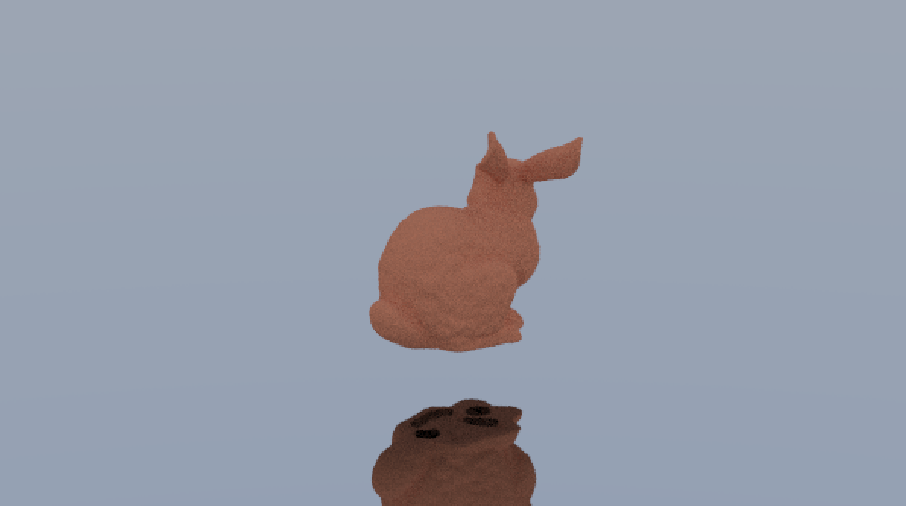
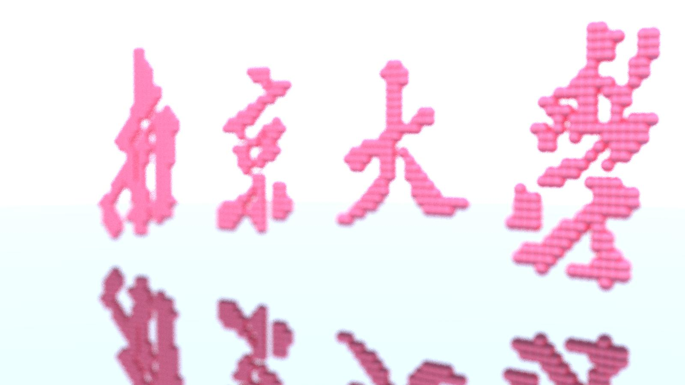
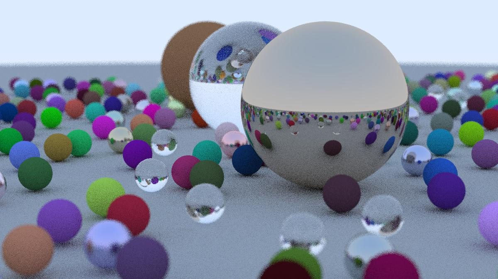
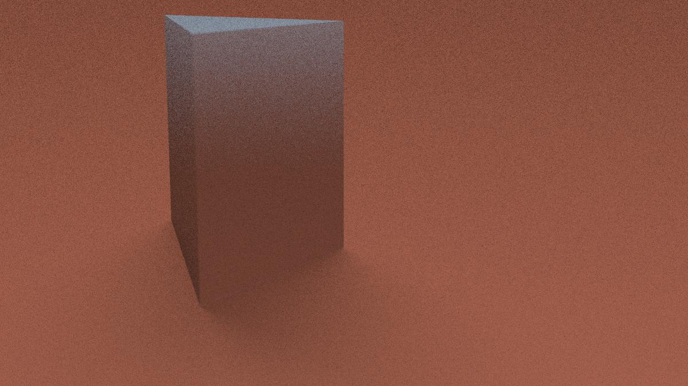

# 图形绘制 作业一

匡亚明学院 洪亮 181240019

## 太长不看版

该实现的都实现了，多写了模型导入，多线程和bvh，代码在[这里](https://github.com/kymWorship/NJUpbr2021-rust)，结果如下：

顺便搞了一个能把logo图片转化为3D图样的python扩展，效果如下：

## 项目相关

本项目用Rust实现，渲染器整体构成参照了Raytracing in one weekend，相比较优势主要在编译器能预先分配每个物件实例需要的空间，更安全一些。多线程使用了rayon包允许迭代器并行化。

## 形状实现

平面用三角形实现

